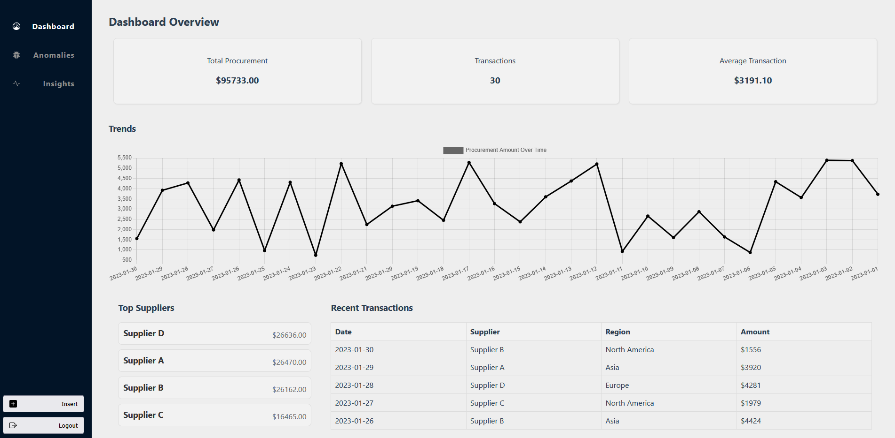
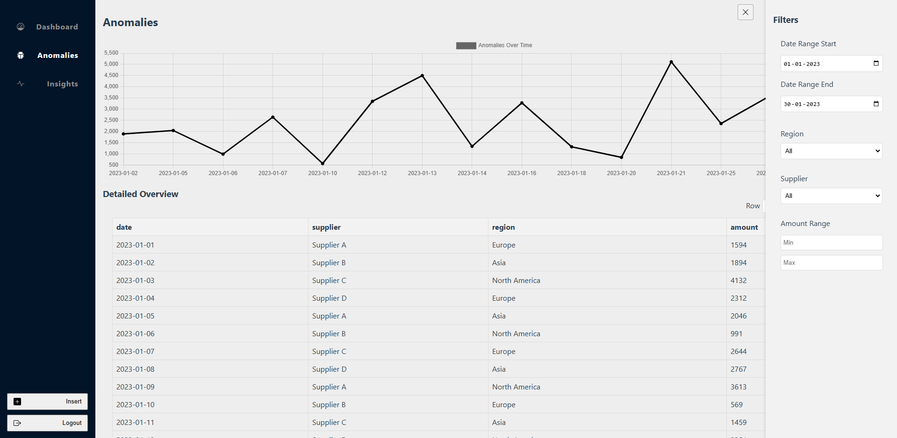
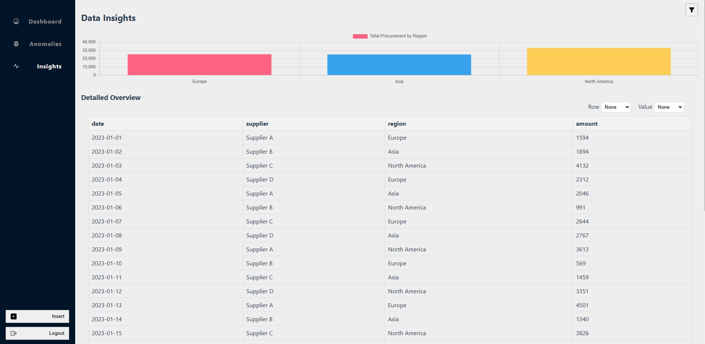
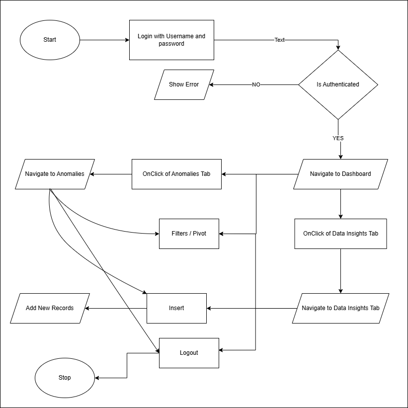

# Supply Chain Analytics Dashboard

## Overview

The Supply Chain Analytics Dashboard is a comprehensive tool designed to help users manage and analyze procurement activities efficiently. It provides insights into procurement trends, anomalies, and detailed data analysis, making it an invaluable resource for procurement managers and analysts.

### Design Rationale

**Usability**: The dashboard is designed with a user-centric approach, ensuring that even non-experts can navigate and utilize its features effectively. The interface is clean and intuitive, with a logical layout that guides users through their tasks. Interactive elements like charts and tables are designed to be engaging and informative, allowing users to explore data with minimal effort.

**Scalability**: The architecture of the dashboard is built to handle increasing data volumes and user demands. By leveraging efficient state management and API response caching techniques, the system can accommodate large datasets without compromising performance. The modular design allows for easy integration of new features and data sources, ensuring that the dashboard can evolve with changing business needs.

**Data Complexity**: The dashboard presents complex procurement data in a simplified manner, using charts and filters to highlight key insights. Pivot tables and dynamic charts allow users to drill down into specific data points, uncovering patterns and anomalies without being overwhelmed.

### Scalability Considerations

To ensure the dashboard remains responsive and usable as it scales, several strategies are employed:

- The use of asynchronous data fetching and caching mechanisms minimizes load times and reduces server strain. This ensures that even as data volumes grow, the dashboard remains fast and responsive.

- The component-based architecture allows for easy updates and feature additions. New data sources or analytical tools can be integrated without disrupting existing functionality, providing flexibility to adapt to future needs.

- Techniques such as code splitting used to optimize performance, ensuring that only necessary components are loaded at any given time. This reduces initial load times and enhances the user experience.

### Visual Design and Accessibility

The prototype is designed with a cohesive visual identity, using a consistent color palette and typography to create a unified look and feel. High contrast colors and readable fonts are employed to enhance visibility. CSS variables are used to define primary, secondary, and background colors, allowing for easy customization and ensuring that the design remains accessible to users with visual impairments. The layout is responsive, adapting to different screen sizes and devices, ensuring that the dashboard is accessible to all users, regardless of their device or environment.

## Home Dashboard



## Anomalies



## Data Insights



## Tech Stack

- ReactJS
- Tanstack/react-query
- React-Router-Dom
- Chart.JS
- API is simulated

## Features

- **User Authentication**: Secure login to access the dashboard.
- **Dashboard Setup**: Customize the dashboard with filters and dimensions.
- **Procurement Data Management**: Add, view, and analyze procurement data.

## User Flow



### 1. Logging In

- **Access the Login Page**: Users start by entering their credentials on the login page. Use `admin` as username and `password` as password.
- **Authentication**: Upon successful login, users are redirected to the main dashboard.

### 2. Setting Up the Dashboard

- **Navigation**: Use the navbar to navigate between different sections: Dashboard Home, Anomalies, Data Insights.
- **Filters**: Each section has specific filters accessible via the sidebar. Users can filter data by date range, region, supplier, and amount(Depends on the example data)
- **Select Dimension**: In the Data Insights section, users can choose to view data aggregated by region or supplier.

### 3. Adding Procurement Data

- **Data Entry**: Users can add new procurement activities through a form, specifying details like supplier, region, amount, and date. This can be improved to importing the csv file as well.

### 4. Analyzing

- **Trends and Anomalies**: Use interactive charts to identify trends and anomalies in procurement data.
- **Detailed Insights**: Drill down into specific data points for a more detailed analysis.

## Design Choices

### Usability

- **Intuitive Interface**: The dashboard is designed with non-experts in mind, featuring a clean layout and easy navigation.
- **Interactive Elements**: Charts and tables are interactive, allowing users to click and explore data points.

### Scalability

- **Data Handling**: The system efficiently handles increasing data volumes with caching and efficient state management.
- **User Management**: It can support multiple users with role-based access, ensuring scalability as the user base grows.

### Data Complexity

- **Insights Presentation**: Data is presented using pivot tables and filters, allowing users to explore complex datasets without being overwhelmed.
- **Visual Cues**: Use of charts and color coding to highlight key insights and anomalies.

## Accessibility

- **High Contrast and Readability**: The dashboard uses high contrast colors and readable fonts.
- **Color Variables**: Primary, secondary, and background colors are defined using CSS variables to ensure consistency and accessibility.

## Installation and Deployment

### Installation Steps

1. **Clone the Repository**:

   ```bash
   git clone https://github.com/nikhilkalburgi/supply-chain-dashboard.git
   cd supply-chain-dashboard
   ```

2. **Install Dependencies**:

   ```bash
   npm install
   ```

3. **Run the Application**:

   ```bash
   npm start
   ```

### Structure of the Example Data

The structure of the data is very simple but can expand based on needs. As of now, it has 4 fields:

1. Date
2. Supplier
3. Region
4. Amount
